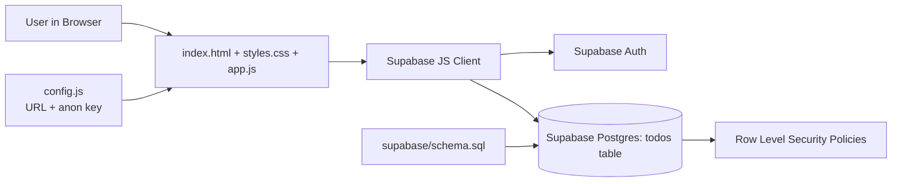
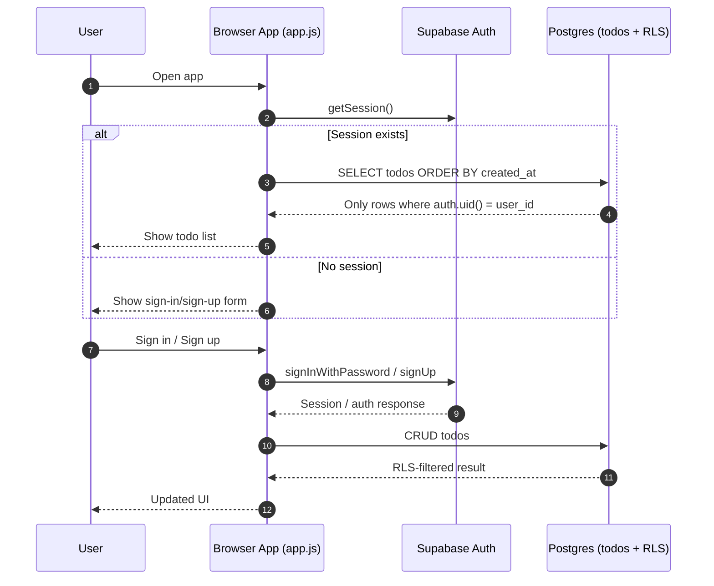
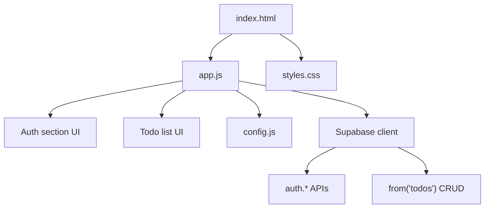
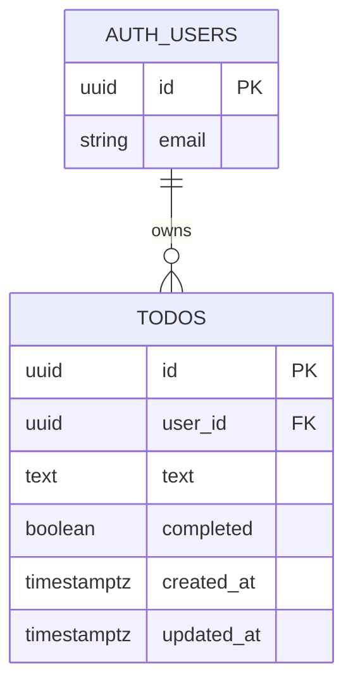
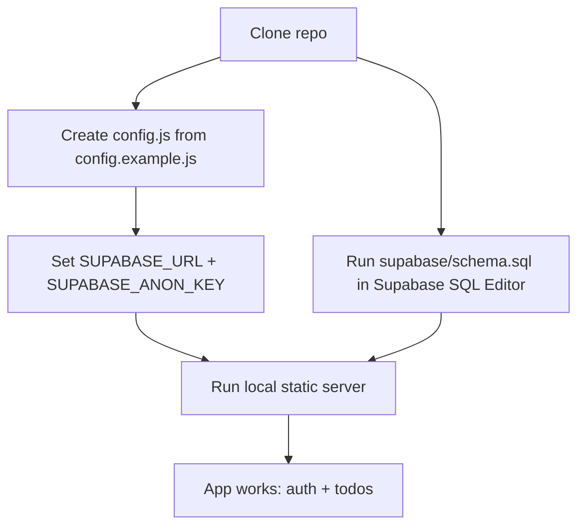

# To-do list (Supabase)

A small browser app for managing personal tasks. It uses **email and password authentication** and stores todos in **Supabase** (Postgres) with **Row Level Security** so each user only sees their own rows.

## Features

- Sign up, sign in, and sign out
- Create, read, update, and delete todos (add, complete via checkbox, inline edit, delete, clear all completed)
- Data persisted in your Supabase project; session handled in the browser by the Supabase client

## Tech stack

- HTML, CSS, and JavaScript (ES modules)
- [Supabase](https://supabase.com/) for Auth and database
- [`@supabase/supabase-js`](https://github.com/supabase/supabase-js) loaded from an ESM CDN (`esm.sh`)

## Prerequisites

- A [Supabase](https://supabase.com/) account and a new or existing project
- **Python 3** (or any static file server) to serve the files over HTTP locally  
  Node.js is not required to run the app.

## Setup

1. **Clone or download** this repository and open the project folder (the one that contains `index.html`).

2. **Configure Supabase credentials**
   - Copy `config.example.js` to `config.js`.
   - In the Supabase dashboard, open **Project Settings → API**.
   - Set `SUPABASE_URL` to your **Project URL** and `SUPABASE_ANON_KEY` to the **anon public** key (not the `service_role` key).

3. **Create the database objects**
   - In Supabase, open **SQL Editor**, paste the contents of `supabase/schema.sql`, and run it once.
   - This creates the `todos` table, indexes, RLS policies, and an `updated_at` trigger.

4. **Auth**
   - Under **Authentication → Providers**, ensure **Email** is enabled (default on many projects).
   - If **email confirmation** is required for your project, complete the confirmation link in your inbox before signing in.

## Run locally

From the project directory:

```bash
python3 -m http.server 8080
```

Then open [http://localhost:8080](http://localhost:8080) in your browser.

Use **http://** (or **https://** if you use another server with TLS). Opening `index.html` via **file://** may break ES module loading.

## Project layout

| Path | Purpose |
| ------ | --------- |
| `index.html` | Page structure and script entry |
| `styles.css` | Layout and styling |
| `app.js` | Supabase client, auth, and todo UI |
| `config.example.js` | Example exports for URL and anon key |
| `config.js` | Your real keys (create locally; listed in `.gitignore`) |
| `supabase/schema.sql` | Table, RLS, and trigger (run in Supabase SQL Editor) |
| `.gitignore` | Keeps local secrets out of version control |
| `LICENSE` | License terms (MIT) |

## Documentation diagrams

These diagrams explain how the app is structured and how data flows from the browser to Supabase.

### 1) Solution architecture



- The app is frontend-only (no custom backend server).
- The browser uses the Supabase client directly for auth and database CRUD.
- RLS policies in Postgres enforce per-user data isolation.

### 2) Runtime flow (auth + todos)



- On load, the app checks for a session.
- If authenticated, it loads todos; otherwise, it shows auth UI.
- Every todo read and write still goes through RLS checks.

### 3) Frontend module map



- `index.html` provides the DOM structure.
- `app.js` handles auth state, UI events, and Supabase operations.
- `config.js` injects project URL and anon key into the app.

### 4) Data model and security



- Each todo row belongs to one authenticated user.
- Policy rule concept: allow access only when `auth.uid() = todos.user_id`.
- This is why the anon key can be used in frontend safely when RLS is correct.

### 5) Setup dependency flow



- Both config and schema setup are required before local run.
- Missing either step leads to auth and database errors.

## Security and publishing

- Never commit the **`service_role`** key, database password, or other secrets. Only the **anon public** key belongs in the frontend; **RLS** policies restrict data access per user.
- `config.js` is ignored by git. Do not commit ad-hoc copies of keys in other files either; see `.gitignore`.
- If a secret was ever pushed to a public repository, **rotate** that key in the Supabase dashboard and remove it from git history if needed.

## Troubleshooting

- **Blank page or module / import errors in the console** — Serve the folder with a local HTTP server; do not rely on `file://`.
- **Auth errors after sign up** — Confirm your email if the project requires it, or try signing in with the correct password.
- **Todos do not load or requests fail** — Ensure you are signed in, `schema.sql` ran successfully, and `config.js` uses the correct project URL and anon key.

## License

This project is licensed under the **MIT License**. See the [`LICENSE`](LICENSE) file in the repository root for the full text.
